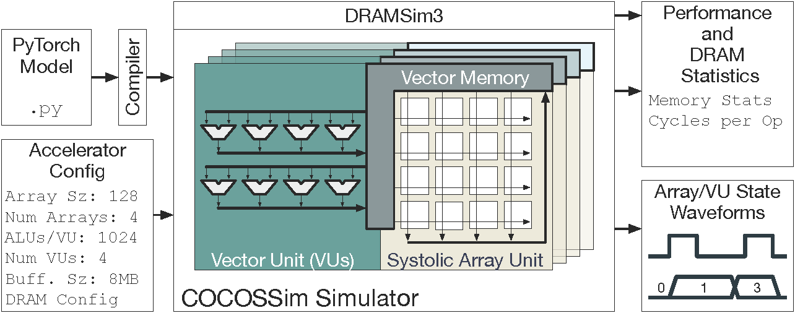

# COCOSSim: Cycle-Accurate Neural Network Accelerator Simulator

**COCOSSim** is a high-performance, cycle-accurate simulator for neural network accelerators featuring systolic array architectures. Designed for researchers and engineers working on AI accelerator design and optimization.

## 🚀 Quick Start

```bash
# Clone and build
git clone https://github.com/mc186/cocossim.git
cd cocossim && git submodule update --init --recursive
mkdir build && cd build && cmake .. && make -j$(nproc)

# Run your first simulation
echo "Matmul 128 256 512" > test.txt
./cocossim test.txt
```

## Key Features

### Heterogeneous Compute Units Support
- Support for heterogeneous systolic arrays including Weight Stationary (WS) and Output Stationary (OS).
- Vector unit modeling for activation layers.
- Independent, parallel scheduling across processing units
- Realistic resource contention modeling


### Comprehensive Layer Support
- **Matrix Operations**: GEMMs, Convolutions
- **Attention**: Multi-head self-attention mechanisms
- **Activations**: Element-wise operations and normalization

### Realistic Memory Modeling
- **DRAMSim3 Integration**: Cycle-accurate memory simulation using DRAMSim3 with multiple memory types including HBM, DDR4, DDR5.
- **Buffer Modelling**: Compute units modeled to interact with activation and weight buffers.

### Detailed Performance Analysis
- Cycle-accurate timing
- Per-unit utilization metrics
- Memory bandwidth analysis
- VCD waveform generation for debugging

## Example Results
```bash
./cocossim transformer_layer.txt
```

```
PHASE: 0, Cycles: 15,234, Jobs finished: 12/12, DRAM CMDs: 1,456
Cycles 15234
SYSTOLIC_ARRAY 87.45% 
VECTOR_UNIT 23.67%
```

## Architecture Overview
COCOSSim uses **state machine models** at its core to simulate compute units with cycle-accurate precision. Each processing unit (systolic arrays and vector units) is implemented as a finite state machine that interacts with the job scheduler and memory system through well-defined interfaces.


<!-- ```
┌─────────────────────────────────────────────────────────┐
│                    COCOSSim Core                        │
├─────────────────┬──────────────────┬────────────────────┤
│  Layer Parser   │  Job Scheduler   │ Performance Stats  │
│                 │                  │                    │
│ • Neural Layers │ • Multi-Core     │ • Cycle Counts    │
│ • Tensor Ops    │ • Dependencies   │ • Utilization     │
│ • Parallelism   │ • Load Balancing │ • Memory Traffic  │
└─────────────────┼──────────────────┼────────────────────┘
                  │                  │
┌─────────────────┼──────────────────┼────────────────────┐
│           Processing Units         │   Memory System    │
├─────────────────┬──────────────────┼────────────────────┤
│ Systolic Arrays │   Vector Units   │    DRAMSim3       │
│                 │                  │                    │
│ • WS/OS Modes   │ • Element-wise   │ • Realistic Timing│
│ • Configurable  │ • Reductions     │ • Multiple Types  │
│ • Multi-Core    │ • Broadcasting   │ • Bank Modeling   │
└─────────────────┴──────────────────┴────────────────────┘
``` -->

**Core Design Principles:**
- **State Machine Processing Units**: Each compute unit operates as a cycle-accurate state machine
- **Job Scheduler Integration**: State machines receive jobs and report completion status
- **Memory System Interaction**: State transitions trigger memory requests and handle responses

## 📚 Documentation

### Getting Started
- **[Installation](guides/installation.md)** - Setup and build instructions
- **[Basic Usage](guides/basic-usage.md)** - Your first simulations
- **[Examples](examples/basic.md)** - Practical examples and tutorials

### Architecture & Design
- **[System Architecture](guides/architecture.md)** - High-level design overview
- **[Systolic Arrays](guides/systolic-arrays.md)** - WS vs OS execution modes

### API Reference
- **[Core Classes](api/core-classes.md)** - Job, State, Arch APIs

## Use Cases

### Research Applications
- **Architecture Exploration**: Compare different heterogeneous compute unit configurations
- **Memory System Analysis**: Study the impact of different memory hierarchies  
- **Parallelization Studies**: Analyze scaling behavior across core counts
- **Workload Characterization**: Understand compute vs memory bottlenecks
- **Performance Prediction**: Estimate performance for neural network models on your hardware

## Why COCOSSim?

- **Extremely Fast Simulation**: 
State of the art speed for Neural Network Accelerator simulation.
- **Cycle-Accurate**: Precise timing models for realistic performance estimates
- **Validated against real hardware**: Based on real accelerator architectures and behaviors. Validated on Google TPU.
- **Scalable**: Efficient simulation of large-scale multi-core systems
- **Configurable**: Extensive parameters for architecture customization
- **Modular Design**: Easy to add new processing units and layer types.
- **Open Source**: Full access to source code for research and development


## Getting Involved

### 📖 Learn More
- [Installation Guide](guides/installation.md) - Get up and running in minutes
- [Architecture Deep Dive](guides/architecture.md) - Understand the system design
- [API Documentation](api/core-classes.md) - Integrate COCOSSim into your workflow

### 🔗 Connect
- **GitHub**: [View source code and contribute](https://github.com/mc186/cocossim)
- **Issues**: [Report bugs and request features](https://github.com/mc186/cocossim/issues)
- **Discussions**: [Join the community](https://github.com/mc186/cocossim/discussions)


**Ready to get started?** → [Install COCOSSim](guides/installation.md) and run your first simulation in under 5 minutes!

*COCOSSim is developed by the APEX Lab at Duke University and is available under the Apache License 2.0.*